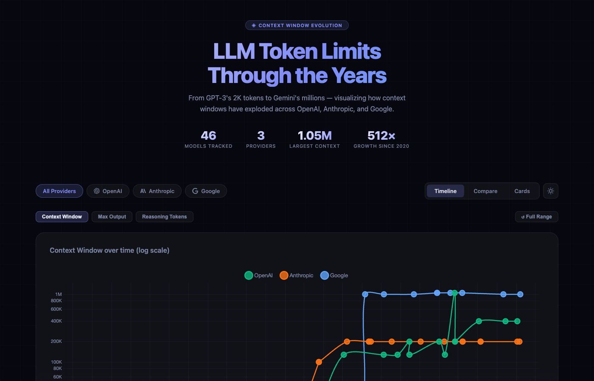

# LLM Context Window Evolution

An interactive, single-file webapp visualizing the dramatic growth of context window sizes across **OpenAI**, **Anthropic**, and **Google** models — from GPT-3's 2,048 tokens in 2020 to 1 million+ tokens in 2026.



## Live Demo

Open `index.html` in any modern browser. No build step, no server, no dependencies to install.

---

## What It Shows

The app tracks three key token limits across 45+ models:

| Metric | Description |
|---|---|
| **Context Window (Input)** | Max tokens the model can receive as input (prompt + history) |
| **Max Output** | Max tokens the model can generate in a single response |
| **Reasoning Tokens** | Internal "thinking" budget for chain-of-thought reasoning models (o1, Claude 3.7+, Gemini 2.5+) |

The I/O breakdown view shows how the output budget compares as a *fraction* of the total context — revealing that modern large-context models allocate less than 1% of their window to output.

---

## Views

### Timeline
Line chart with all models plotted by release date and token count (log scale). Zoom in with:
- **Desktop**: scroll wheel or trackpad pinch
- **Mobile**: two-finger pinch gesture
- **Pan**: click-drag (desktop) or one-finger drag after zooming (mobile)
- **Reset**: click "↺ Reset Zoom"

Switch between Context Window, Max Output, and Reasoning Tokens using the metric buttons.

### Compare
Horizontal bar chart showing all models sorted by the selected metric. The **I/O Breakdown** view shows a stacked bar for each model divided into:
- Input capacity (colored by provider)
- Max output (orange)
- Reasoning budget (purple)

### Cards
Grid of model cards, newest first. Each card shows:
- A stacked I/O split bar (input + output + reasoning proportions)
- A standalone output bar (relative to the highest-output model)
- A reasoning bar (if applicable)
- The output-to-context ratio as a percentage
- A short description of what made the model notable

---

## Reference Links

### Official Provider Documentation

These are the authoritative sources for context windows, output limits, pricing, and release notes.

#### OpenAI
| Page | What you'll find |
|---|---|
| [Models overview](https://platform.openai.com/docs/models) | Full model list with context windows and output limits |
| [GPT-5.2 model page](https://platform.openai.com/docs/models/gpt-5.2) | Specs for the latest GPT-5 generation |
| [o3 model page](https://platform.openai.com/docs/models/o3) | Reasoning model specs & thinking budget |
| [Pricing](https://openai.com/pricing) | Input/output cost per million tokens |
| [Tokenizer](https://platform.openai.com/tokenizer) | Interactively count tokens in any text |

#### Anthropic
| Page | What you'll find |
|---|---|
| [Models overview](https://platform.claude.com/docs/en/about-claude/models/overview) | All Claude models with context windows & output limits |
| [Context windows guide](https://platform.claude.com/docs/en/build-with-claude/context-windows) | How context windows work, beta 1M token info |
| [What's new in Claude 4.6](https://platform.claude.com/docs/en/about-claude/models/whats-new-claude-4-6) | Latest model release notes |
| [Pricing](https://platform.claude.com/docs/en/about-claude/pricing) | Per-token pricing by model |
| [Release notes](https://platform.claude.com/docs/en/release-notes/overview) | Chronological changelog of all Claude releases |

#### Google
| Page | What you'll find |
|---|---|
| [Gemini API models](https://ai.google.dev/gemini-api/docs/models) | All Gemini models with token limits |
| [Gemini 3.1 Pro model card](https://deepmind.google/models/model-cards/gemini-3-1-pro/) | Latest Gemini specs and benchmarks |
| [Vertex AI model docs](https://docs.cloud.google.com/vertex-ai/generative-ai/docs/models/gemini) | Enterprise Gemini model reference |
| [Google AI pricing](https://ai.google.dev/pricing) | Input/output pricing for Gemini models |

---

### Third-Party Leaderboards & Comparisons

These independent sites aggregate and compare models across providers — useful for benchmarks, pricing analysis, and at-a-glance model selection.

| Site | Focus |
|---|---|
| [Artificial Analysis](https://artificialanalysis.ai/leaderboards/models) | Compares 100+ models on intelligence, speed, cost, context window. Most comprehensive independent leaderboard. |
| [LLM Stats](https://llm-stats.com) | Token limits, pricing, benchmarks, and release timelines. Includes a model update feed. |
| [LMArena](https://lmarena.ai) | Crowdsourced blind battles between models. Elo-style ranking based on human preference votes. |
| [Arena.ai Leaderboard](https://arena.ai/leaderboard) | Multi-modal leaderboard (text, image, video, code) ranked by human votes. |
| [Hugging Face Open LLM Leaderboard](https://huggingface.co/spaces/open-llm-leaderboard/open_llm_leaderboard) | Benchmark scores (MMLU, ARC, HellaSwag etc.) for open-source models. |
| [elvex Context Length Comparison](https://www.elvex.com/blog/context-length-comparison-ai-models-2026) | Focused comparison of context window sizes with practical guidance. |
| [CloudIDR Pricing Comparison](https://www.cloudidr.com/blog/llm-pricing-comparison-2026) | Input/output cost analysis across 60+ models, updated weekly. |

---

### Wikipedia Model Pages

Good for historical release dates, parameter counts, and high-level capability comparisons:

- [GPT series](https://en.wikipedia.org/wiki/GPT-4) — OpenAI model history
- [Claude (language model)](https://en.wikipedia.org/wiki/Claude_(language_model)) — Anthropic model history
- [Gemini (language model)](https://en.wikipedia.org/wiki/Gemini_(language_model)) — Google model history

---

### Data Notes

> Token counts reflect **general availability (GA)** limits at launch unless stated otherwise.
> - Some models have higher limits in restricted beta (e.g., Claude 4.5+ have a 1M token beta context available to API tier 4+).
> - Reasoning token budgets for some 2025–2026 models are estimated from output token budgets where official figures are not published.
> - A useful rule of thumb: effective reliable context is often **60–70% of the advertised maximum** for most models.

---

## Model Timeline

| Year | Milestone |
|---|---|
| 2020 | GPT-3 launches with 2K context |
| 2022 | ChatGPT (GPT-3.5 Turbo) at 4K context |
| 2023 | Claude 1.3 breaks 100K; Claude 2.1 hits 200K |
| 2024 | Gemini 1.5 Pro reaches 1M; o1 introduces reasoning tokens |
| 2025 | GPT-4.1 hits 1M; GPT-5 reaches 400K; Claude 4.x with extended thinking |
| 2026 | Claude Opus 4.6 tops rankings; Gemini 3.1 Pro at 77.1% ARC-AGI-2 |

---

## Tech Stack

- Pure HTML + CSS + JavaScript — no framework
- [Chart.js 4.4](https://www.chartjs.org/) — timeline and comparison charts
- [chartjs-adapter-date-fns](https://github.com/chartjs/chartjs-adapter-date-fns) — time scale
- [chartjs-plugin-zoom 2.0](https://www.chartjs.org/chartjs-plugin-zoom/) — scroll/pinch zoom
- [Hammer.js](https://hammerjs.github.io/) — touch gesture support for zoom
- Provider icons from [Simple Icons](https://simpleicons.org/) (inline SVG paths)

---

## File Structure

```
index.html   # Layout, styles, and HTML structure
app.js       # Model data, chart logic, and interactions
README.md    # This file
```
